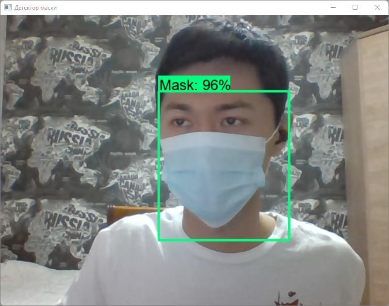

# Face-Mask_Detector

## Дипломный проект

## Создание системы мониторинга и контроля доступа на основе распознавания образов

### Используемые технологии

- [**Conda** 4.11.0](https://www.anaconda.com/) с [**Python** 3.9.7](https://www.python.org/)
- [**Tensorflow** 2.7.0](https://www.tensorflow.org/)
- [**Keras** 2.7.0](https://keras.io/)
- [**OpenCV** 4.5.5](https://opencv.org/)
- [Предварительно тренированные модели Tensorflow](https://github.com/tensorflow/models)
- [**Protocol Buffers** 3.19.2](https://github.com/protocolbuffers/protobuf/)
- [**SSD MobileNet V2 FPNLite 320x320**](https://github.com/tensorflow/models/blob/master/research/object_detection/configs/tf2/ssd_mobilenet_v2_fpnlite_320x320_coco17_tpu-8.config). [Скачать](http://download.tensorflow.org/models/object_detection/tf2/20200711/ssd_mobilenet_v2_fpnlite_320x320_coco17_tpu-8.tar.gz)
- [**LabelImg**](https://github.com/tzutalin/labelImg). Для графической отметки вручную.
- [**CUDA** 11.2](https://developer.nvidia.com/cuda-11.2.2-download-archive)
- [**cuDNN** 8.1.1](https://developer.nvidia.com/rdp/cudnn-archive)

### [Инструкция по установке и настройке окружения для распознавания объектов при помощи Tensorflow](https://tensorflow-object-detection-api-tutorial.readthedocs.io/en/latest/install.html)

### [Список GPU, поддерживающих CUDA и оценка их вычислительных возможностей](https://developer.nvidia.com/cuda-gpus)

### [Совместимость версий Tensorflow + Python + Компилятора + Инструмента Сборки + cuDNN + CUDA](https://www.tensorflow.org/install/source_windows#gpu)

### [Инструкция установки CUDA](https://docs.nvidia.com/cuda/archive/11.2.2/cuda-installation-guide-microsoft-windows/index.html)

### Пакеты для работы LabelImg

```
conda install -c anaconda lxml
conda install pyqt=5
```

### Используемый набор данных

- [**Kaggle**. Face Mask Detection by Larxel](https://www.kaggle.com/andrewmvd/face-mask-detection) из *853* изображений

## В маске

  


## Без маски

  

